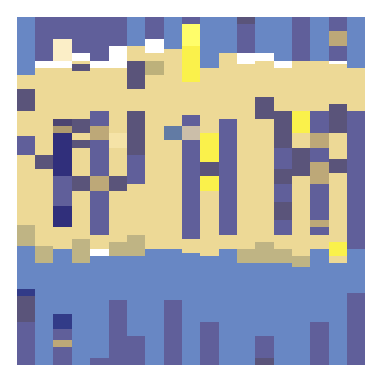

```{r setup, include=FALSE}
knitr::opts_chunk$set(echo = FALSE
                      , message = FALSE
                      , warning = FALSE)
```

```{r, include = FALSE}
library(tidyverse)
library(lubridate)
library(gganimate)
library(ical)

path <- "C:/Users/kcorreia/Dropbox (Amherst College)/Teaching/Spring 2020/Stat231/Calendar Project/my_calendar"

my_calendar <- ical_parse_df(file = paste0(path,"/kcorreia@amherst.edu.ics")) %>%
  mutate(start_datetime = with_tz(start, tzone = "America/New_York")
    , end_datetime = with_tz(end, tzone = "America/New_York")
    , length_sec = end_datetime - start_datetime
    , length_min = length_sec/60
    , length_hrs = as.numeric(length_min/60)
    , date = floor_date(start_datetime, unit = "day"))

#testing <- my_calendar %>%
#  mutate(start_time = strftime(start_datetime, format = "%H:%M:%S"))

# collected data April 12 - May 1
# identify categories: sleep, kids, teach, service, research
# and rectangle shapes: xstart and xend are for each day; ystart and yend are
# for each hour
calendar_0 <- my_calendar %>%
  filter(date >= "2020-04-12" & date <= "2020-05-01") %>%
  mutate(x_start = (as.numeric(date %--% "2020-04-12")/(3600*24))*-1
        , x_end = x_start + 1
        , y_start_hour =  hour(start_datetime) 
        , y_start_min = minute(start_datetime)
        , y_start = y_start_hour + (y_start_min/60)
        , y_end0 = hour(end_datetime) + (minute(end_datetime)/60)
        , y_end = ifelse(y_end0 < y_start, yes = 24, no = y_end0)
        , sleep = as.numeric(str_detect(tolower(summary), "sleep") | 
                    str_detect(tolower(description), "sleep"))
        , kids = as.numeric(str_detect(tolower(summary), "kid") | 
                    str_detect(tolower(description), "kid"))
        , teaching = as.numeric(str_detect(tolower(summary), "teach") | 
                    str_detect(tolower(description), "teach"))
        , research = as.numeric(str_detect(tolower(summary), "research") | 
                    str_detect(tolower(description), "research"))
        , service = as.numeric(str_detect(tolower(summary), "service") | 
                    str_detect(tolower(description), "service"))) %>%
  arrange(start_datetime)

# get extra rows from events that spanned more than one day
calendar_extras <- calendar_0 %>%
  filter(y_end0 < y_start) %>%
  rename(x_start0 = x_start, x_end0 = x_end) %>%
  mutate(date = floor_date(end_datetime, unit = "day")
         , y_start = 0
         , y_end = y_end0
         , x_start = x_start0 + 1
         , x_end = x_end0 + 1) %>%
  select(-c(x_start0, x_end0))

# combine rows
calendar_1 <- calendar_0 %>%
  bind_rows(calendar_extras) %>%
  arrange(start_datetime) 

# checks
calendar_1 %>% summarize(sum(sleep))
calendar_1 %>% summarize(sum(research))
calendar_1 %>% summarize(sum(service))
calendar_1 %>% summarize(sum(kids))
calendar_1 %>% summarize(sum(teaching))
temp <- calendar_1 %>%
  filter(sleep == 0 & research == 0 & service == 0 & kids == 0 & teaching == 0)

# make long
calendar_long <- calendar_1 %>%
  select(date, x_start, x_end, y_start, y_end
         , sleep, kids, teaching, research, service) %>%
  mutate(y_length = y_end - y_start) %>%
  group_by(date, y_length, x_start, x_end, y_start, y_end) %>%
  gather(key = "Category", value = "Include"
         , sleep, kids, teaching, research, service) %>%
  arrange(date, y_start) %>%
  filter(Include == 1)
```

```{r, include=FALSE}
color_palettes0 <- read_csv("C:/Users/kcorreia/Dropbox (Amherst College)/Teaching/Spring 2020/Stat231/Calendar Project/my_calendar/all_palettes.csv") 

gothic_occult <- data.frame(type = rep("added", 5)
                            , name = rep("Gothic Occult Color Palette",5)
                            , hexcode = c("#0b0b0b", "#7c7676", "#cecbcb"
                                          , "#351765", "#9c59cc")
                            , num = rep(max(color_palettes0$num)+1, 5))

color_palettes <- bind_rows(color_palettes0, gothic_occult)

# create figure function
# input changes color palette
data_art <- function(palette_num){
  
  color_choice <- color_palettes %>%
    filter(num == palette_num)

  ggplot(data = calendar_long) +
    geom_rect(aes(xmin = x_start, xmax = x_end
                  , ymin = y_start, ymax = y_end
                  , fill = Category), alpha = 0.7) +
    #labs(x = "Days since April 12, 2020"
    #     ,y = "Hour of the Day") +
    xlim(0,19) +
    ylim(0,24) + 
    scale_fill_manual(values = as.character(color_choice$hexcode)) + 
    theme_void() +
    theme(legend.position = "none")
}

#data_art(1)
#data_art(2)
#data_art(3)
#data_art(4)
#data_art(5)
#data_art(6)
```


```{r, eval = FALSE}
library(animation)
ani.options(convert ="/c/Program Files/ImageMagick-7.0.10-Q16/magick")
## make sure ImageMagick has been installed in your system

# number of different palettes 
num_pal <- max(color_palettes$num)

saveGIF({
  for (i in 1:num_pal) {
    print(data_art(i))
  }
}, movie.name = "data_art.gif")
```



Any way I color it, my schedule is out of wack these days.

# What are we looking at?  Data to Art

From April 12 to May 1, 2020, I documented my time spent in five categories: kids, teaching, sleep, research, and service.  These categories are broad -- when I say "kids", sometimes I'd be actively engaged with them (reading, biking, crafting, etc.); other times, I'd be peripherally engaged while cooking dinner or cleaning the house, or completing other non-work tasks.  Similarly, the "teaching" category included time prepping for a class, recording lectures and labs, Zoom classes, and grading, but I also lumped in some activities that aren't strictly teaching but I wanted to document as work (e.g. time responding to emails and time in department meetings).  "Service" includes activities related to service to the department or college (e.g. work on committees).

In documenting my time this way, my goal was to see how often I was focused on just one of these activities versus how often I was multitasking.  I don't consider spending time with my kids as a "task", but multi-activity-ing doesn't have the same ring.  By collecting this data, I also hoped that I'd be more conscious of the various demands on my time and attempt to minimize the multitasking.  When I was playing with the kids, I'd try to give them my full attention; when I was working, I wouldn't get sidetracked by news articles on the latest coronavirus numbers or sucked into scrolling through funny tweets; at bedtime, I'd put away my phone, think happy thoughts, and sleep well.  That was the plan, anyway. How well did I do?  Hint: I'm writing this post right now ... in bed ... on my phone. 

## My Objet d'art

```{r}
static_color <- color_palettes %>%
  filter(name == "Gothic Occult Color Palette")

static_plot <- data_art(unique(static_color$num))
static_plot
```

```{r, include = FALSE, eval = FALSE}
ggsave(filename = "static_data_art"
       , plot = static_plot
       , device = "jpeg")
```

## Breaking it down 

```{r}
ggplot(data = calendar_long) +
    geom_rect(aes(xmin = x_start, xmax = x_end
                  , ymin = y_start, ymax = y_end
                  , fill = Category) 
                  , color = "black", alpha = 0.7) +
    labs(x = "Days since April 12, 2020"
         ,y = "Hour of the Day") +
    xlim(0,19) +
    ylim(0,24) + 
    scale_fill_manual(values = static_color$hexcode) 

# fitting in a little more sleep while kids playing on my bed
ggplot(data = calendar_long) +
    geom_rect(aes(xmin = x_start, xmax = x_end
                  , ymin = y_start, ymax = y_end
                  , fill = Category) 
                  , color = "black", alpha = 0.7) +
    annotate("path",x = 6 + 1.5*cos(seq(0,2*pi,length.out=100))
             , y = 8 + 1.5*sin(seq(0,2*pi,length.out=100))
             , size = 2) +
    geom_label(aes(x = 12.7, y = 9, label = "sleep + kids: I'd often try to get a \n little more sleep while the kids \n played on my bed in the morning")
               , fill = "white") +
    labs(x = "Days since April 12, 2020"
         ,y = "Hour of the Day") +
    geom_segment(aes(x = 6.5, y = 8, xend = 8.7, yend = 8.5)
                , arrow = arrow(length = unit(0.02, "npc"))
                , size = 1.5) +
    xlim(0,19) +
    ylim(0,24) + 
    scale_fill_manual(values = static_color$hexcode) 

# prepping for class with Livy at my side
ggplot(data = calendar_long) +
    geom_rect(aes(xmin = x_start, xmax = x_end
                  , ymin = y_start, ymax = y_end
                  , fill = Category) 
                  , color = "black", alpha = 0.7) +
    annotate("path",x = 4.5 + 1*cos(seq(0,2*pi,length.out=100))
             , y = 16 + 1*sin(seq(0,2*pi,length.out=100))
             , size = 2) +
    geom_label(aes(x = 9, y = 17, label = "teaching + kids: \n prepping for class with \n Livy at my side")
               , fill = "white") +
    labs(x = "Days since April 12, 2020"
         ,y = "Hour of the Day") +
    geom_segment(aes(x = 4.5, y = 16, xend = 6, yend = 17)
                , arrow = arrow(length = unit(0.02, "npc"))
                , size = 1.5) +
    xlim(0,19) +
    ylim(0,24) + 
    scale_fill_manual(values = static_color$hexcode) 


# low point for sleep
ggplot(data = calendar_long) +
    geom_rect(aes(xmin = x_start, xmax = x_end
                  , ymin = y_start, ymax = y_end
                  , fill = Category) 
                  , color = "black", alpha = 0.7) +
    annotate("path",x = 18.5 + 0.8*cos(seq(0,2*pi,length.out=100))
             , y = 6.2 + 2.5*sin(seq(0,2*pi,length.out=100))
             , size = 2) +
    geom_label(aes(x = 14, y = 10, label = "a low point for sleep: \n 3 hours one night")
               , fill = "white") +
    labs(x = "Days since April 12, 2020"
         ,y = "Hour of the Day") +
    geom_segment(aes(x = 18.5, y = 6, xend = 16.5, yend = 9)
                , arrow = arrow(length = unit(0.02, "npc"))
                , size = 1.5) +
    xlim(0,19) +
    ylim(0,24) + 
    scale_fill_manual(values = static_color$hexcode) 

# a glorious hour to myself
ggplot(data = calendar_long) +
    geom_rect(aes(xmin = x_start, xmax = x_end
                  , ymin = y_start, ymax = y_end
                  , fill = Category) 
                  , color = "black", alpha = 0.7) +
    annotate("path",x = 7.5 + 1*cos(seq(0,2*pi,length.out=100))
             , y = 22 + 1*sin(seq(0,2*pi,length.out=100))
             , size = 2) +
    geom_label(aes(x = 11.8, y = 21, label = "a quiet hour to myself")
               , fill = "white") +
    labs(x = "Days since April 12, 2020"
         ,y = "Hour of the Day") +
    geom_segment(aes(x = 7.5, y = 22, xend = 9, yend = 21)
                , arrow = arrow(length = unit(0.02, "npc"))
                , size = 1.5) +
    xlim(0,19) +
    ylim(0,24) + 
    scale_fill_manual(values = static_color$hexcode) 
```


# Some reflections

## Inside-Out, then Upside-Down

I think the change to our semester felt as unexpected and abrupt to me as to any of the students.  On Saturday, March 7, I had flown to Philadelphia for a week-long training with the [Inside-Out Prison Exchange Program](https://www.insideoutcenter.org/ "Inside-Out Prison Exchange Program"){:target="_blank"}.  I was really looking forward to this training as well as the month ahead.  As I saw it, I had this week to be immersed in a deep pedagogical experience in a very different environment from traditional academia, then next week was Spring break -- time off from class for me with my kids still at school meant a rare moment to work in a more relaxed manner.  I was even looking forward to the week after Spring break, when our Data Science class would present their mid-semester projects to the Institutional Research Office. 

I returned home from Philadephia on Friday the 13th; an ominous date, for sure.  Within that short span of time I'd been away -- while I was being turned inside-out -- the world as I knew it was being turned upside down.  Students had left campus.  The College had moved to a remote learning environment for the remainder of the semester.  Events were cancelled.  For my own children, an unexpected half-day of school on Friday turned into an unexpected no-school day on Monday which turned into a month, and eventually the rest of the school year out of school.  My parents cancelled their regular visits to our home.  

What . . . just . . . happened?


### Schedule-less

In the beginning of the semester, when we were on campus, I had gotten into the habit of waking up early in the morning to work rather than stay up at night. I'd get to bed by 9 (ideally) or 10:30 (more realistically) and wake up at 4 or 5 am to work for a few hours before the kids woke up for the day. This schedule was working relatively well for me, and I think I was more productive in those morning hours than when I'd stay up (too late) at night. But, I am not a morning person by nature and, once we went remote, I couldn't seem to motivate myself to pop out of bed at 5 am on a quarantine Monday, let alone on a quarantine Saturday. So, I got stuck in a cycle of working through the night for a night or two, then crashing the next. For the most part, I would focus on just the work and not get distracted. But given how tired I was by the end of the day, I noticed that I couldn't think well, let alone fast, and things were taking me at least three times as long as they should be to get them done. More than once, a common word would slip my mind; at one point I googled "What do you call a thing to put drinks on". (That would be called a "coaster".  Thank you, Google.)

Collecting this data helps me confront what I already know but don't want to admit: the night work is not working for me.  Over the next few months, as I shift my work focus from teaching to a number of upcoming research deadlines, I am going to try harder to get back to my morning work routine.  Dragging myself out of bed at 5 am will be difficult, but it should pay off in the long run since I can be more productive after a good nights rest.

In terms of just focusing on the kids (or at least not on work) when I was with them . . . I was able to do this better some days than others.  In the beginning, I'd notice the kids playing nicely together and try to slip away to my computer to answer a few emails. But my kids have a sixth sense that tells them when I'm trying to sneak in work. They'll have been playing independently while I washed the dishes, or cooked a meal, or folded laundry, but the moment I get on my laptop, they're all like "Mommy, I need you! I need your attention immediately! Why don't you ever play with me?!" Fact check, children: I just played with you for 5,427 hours straight. Give or take a few hours.

It quickly became more frustrating to try to sneak in a little work than it was worth. So, instead, on days when my husband was at work, I'd carve out a few hours (which sometimes slipped into a few more hours) of screen time for the kids and work time for me.  Around the work/screen time, we would play, bike, bake, build, laugh, cry, fight, scream, bike some more, build some more, laugh some more . . . wash, rinse, repeat.   

On Tuesdays and Thursdays, when my husband was home with the kids, I'd be able to focus better on work.  But, even on those days, the kids would be in and out of my "office" (aka the bedroom).  It was hard to ignore Olivia when she was sobbing outside the door, "But, I don't want to play with daddy.  I want to play with you.  I just looooove you soooo much."  Okay, Livy our Lovey our Sweet Little Dovey, come in for a hug.   

. . . the hug usually led to an hour of her making her own objet(s) d'art on my iPad. Here is a small selection of the 915 notes she has created on my iPad since school has been out:


\vspace{0.5in}

Felipe has created his share of art on my iPad, too, including a series of videos of himself singing and dancing (I'll spare you those).  He took to leaving sweet post-it notes on my computer and around my "office": 


"I love you no matter what" . . . unless you don't let me have that fourth cookie I want, then I take it all back, rip up the note, forget forever ! . . . okay, I love you again, "I love you so much love you forever love felipe! happy day!!"  Ah, the ups and downs of pandemic life.  I feel you, kid!

## Hope 
### for a serene summer
### and a face-to-face fall

I LOVE my kids.  I LOVE teaching.  I LOVE sleep.  I am deeply thankful for our health, the extra time I've gotten with my kids, and that I get to continue to teach during a time so many have lost jobs.  At the same time, it has been overwhelming trying to dedicate all the time needed to tend to each during this abnormal semester.  I miss people tremendously.  I look forward to the breather this Summer (hopefully) brings, and a Fall where we're (hopefully) together on campus. 

