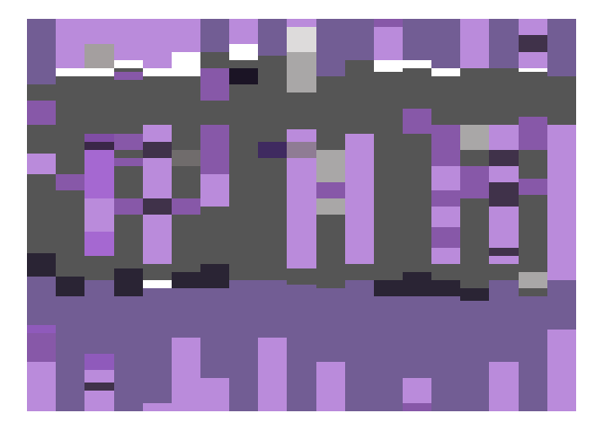
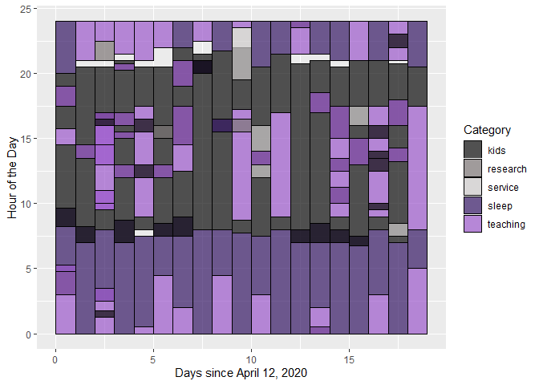
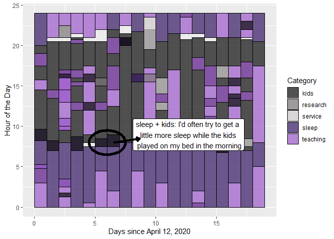
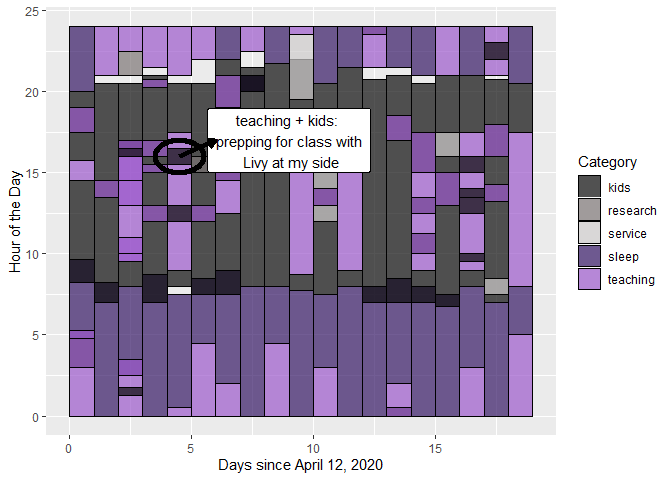
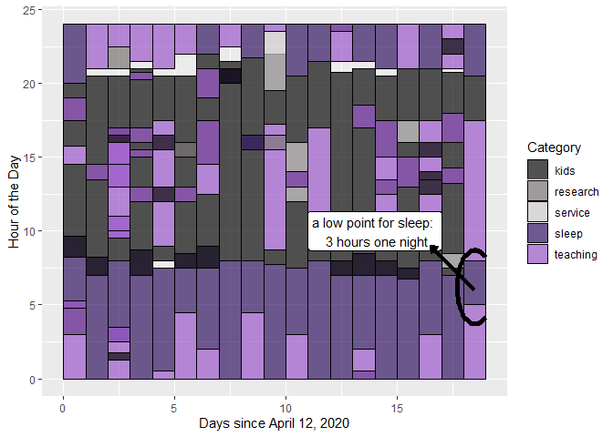
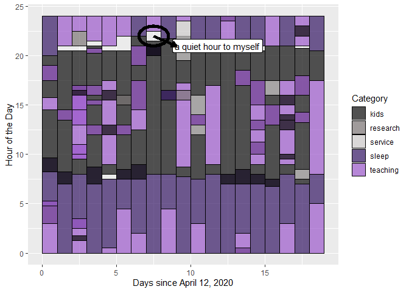

Any way I color it, my schedule is out of wack these days.

What are we looking at? Data to Art
===================================

From April 12 to May 1, 2020, I documented my time spent in five
categories: kids, teaching, sleep, research, and service. These
categories are broad -- when I say "kids", sometimes I'd be actively
engaged with them (reading, biking, crafting, etc.); other times, I'd be
peripherally engaged while cooking dinner or cleaning the house, or
completing other non-work tasks. Similarly, the "teaching" category
included time prepping for a class, recording lectures and labs, Zoom
classes, and grading, but I also lumped in some activities that aren't
strictly teaching but I wanted to document as work (e.g. time responding
to emails and time in department meetings). "Service" includes
activities related to service to the department or college (e.g. work on
committees).

In documenting my time this way, my goal was to see how often I was
focused on just one of these activities versus how often I was
multitasking. I don't consider spending time with my kids as a "task",
but multi-activity-ing doesn't have the same ring. By collecting this
data, I also hoped that I'd be more conscious of the various demands on
my time and attempt to minimize the multitasking. When I was playing
with the kids, I'd try to give them my full attention; when I was
working, I wouldn't get sidetracked by news articles on the latest
coronavirus numbers or sucked into scrolling through funny tweets; at
bedtime, I'd put away my phone, think happy thoughts, and sleep well.
That was the plan, anyway. How well did I do? Hint: I'm writing this
post right now ... in bed ... on my phone.

My Objet d'art
--------------

Breaking it down
----------------

Some reflections
================

Inside-Out, then Upside-Down
----------------------------

I think the change to our semester felt as unexpected and abrupt to me
as to any of the students. On Saturday, March 7, I had flown to
Philadelphia for a week-long training with the [Inside-Out Prison
Exchange
Program](https://www.insideoutcenter.org/ "Inside-Out Prison Exchange Program"){:target="\_blank"}.
I was really looking forward to this training as well as the month
ahead. As I saw it, I had this week to be immersed in a deep pedagogical
experience in a very different environment from traditional academia,
then next week was Spring break -- time off from class for me with my
kids still at school meant a rare moment to work in a more relaxed
manner. I was even looking forward to the week after Spring break, when
our Data Science class would present their mid-semester projects to the
Institutional Research Office.

I returned home from Philadephia on Friday the 13th; an ominous date,
for sure. Within that short span of time I'd been away -- while I was
being turned inside-out -- the world as I knew it was being turned
upside down. Students had left campus. The College had moved to a remote
learning environment for the remainder of the semester. Events were
cancelled. For my own children, an unexpected half-day of school on
Friday turned into an unexpected no-school day on Monday which turned
into a month, and eventually the rest of the school year out of school.
My parents cancelled their regular visits to our home.

What . . . just . . . happened?

### Schedule-less

In the beginning of the semester, when we were on campus, I had gotten
into the habit of waking up early in the morning to work rather than
stay up at night. I'd get to bed by 9 (ideally) or 10:30 (more
realistically) and wake up at 4 or 5 am to work for a few hours before
the kids woke up for the day. This schedule was working relatively well
for me, and I think I was more productive in those morning hours than
when I'd stay up (too late) at night. But, I am not a morning person by
nature and, once we went remote, I couldn't seem to motivate myself to
pop out of bed at 5 am on a quarantine Monday, let alone on a quarantine
Saturday. So, I got stuck in a cycle of working through the night for a
night or two, then crashing the next. For the most part, I would focus
on just the work and not get distracted. But given how tired I was by
the end of the day, I noticed that I couldn't think well, let alone
fast, and things were taking me at least three times as long as they
should be to get them done. More than once, a common word would slip my
mind; at one point I googled "What do you call a thing to put drinks
on". (That would be called a "coaster". Thank you, Google.)

Collecting this data helps me confront what I already know but don't
want to admit: the night work is not working for me. Over the next few
months, as I shift my work focus from teaching to a number of upcoming
research deadlines, I am going to try harder to get back to my morning
work routine. Dragging myself out of bed at 5 am will be difficult, but
it should pay off in the long run since I can be more productive after a
good nights rest.

In terms of just focusing on the kids (or at least not on work) when I
was with them . . . I was able to do this better some days than others.
In the beginning, I'd notice the kids playing nicely together and try to
slip away to my computer to answer a few emails. But my kids have a
sixth sense that tells them when I'm trying to sneak in work. They'll
have been playing independently while I washed the dishes, or cooked a
meal, or folded laundry, but the moment I get on my laptop, they're all
like "Mommy, I need you! I need your attention immediately! Why don't
you ever play with me?!" Fact check, children: I just played with you
for 5,427 hours straight. Give or take a few hours.

It quickly became more frustrating to try to sneak in a little work than
it was worth. So, instead, on days when my husband was at work, I'd
carve out a few hours (which sometimes slipped into a few more hours) of
screen time for the kids and work time for me. Around the work/screen
time, we would play, bike, bake, build, laugh, cry, fight, scream, bike
some more, build some more, laugh some more . . . wash, rinse, repeat.

On Tuesdays and Thursdays, when my husband was home with the kids, I'd
be able to focus better on work. But, even on those days, the kids would
be in and out of my "office" (aka the bedroom). It was hard to ignore
Olivia when she was sobbing outside the door, "But, I don't want to play
with daddy. I want to play with you. I just looooove you soooo much."
Okay, Livy our Lovey our Sweet Little Dovey, come in for a hug.

. . . the hug usually led to an hour of her making her own objet(s)
d'art on my iPad. Here is a small selection of the 915 notes she has
created on my iPad since school has been out:

Felipe has created his share of art on my iPad, too, including a series
of videos of himself singing and dancing (I'll spare you those). He took
to leaving sweet post-it notes on my computer and around my "office":

"I love you no matter what" . . . unless you don't let me have that
fourth cookie I want, then I take it all back, rip up the note, forget
forever ! . . . okay, I love you again, "I love you so much love you
forever love felipe! happy day!!" Ah, the ups and downs of pandemic
life. I feel you, kid!

Hope
----

### for a serene summer

### and a face-to-face fall

I LOVE my kids. I LOVE teaching. I LOVE sleep. I am deeply thankful for
our health, the extra time I've gotten with my kids, and that I get to
continue to teach during a time so many have lost jobs. At the same
time, it has been overwhelming trying to dedicate all the time needed to
tend to each during this abnormal semester. I miss people tremendously.
I look forward to the breather this Summer (hopefully) brings, and a
Fall where we're (hopefully) together on campus.

