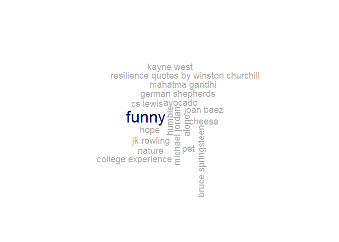

What else was on our minds?
===========================

In one homework assignment, students were asked to web scrape quotes
from the [Brainy Quote](https://www.brainyquote.com/ "Brainy Quote")
website. What terms did we search? What quotes did we find?

### Searched terms

### Quotes

    "Associate with men of good quality if you esteem your own reputation; for it is better to be alone than in bad company." --George Washington 
     
    "A man can be himself only so long as he is alone, and if he does not love solitude, he will not love freedom, for it is only when he is alone that he is really free." --Arthur Schopenhauer 
     
    "All men's miseries derive from not being able to sit in a quiet room alone." --Blaise Pascal 
     
    "Alone we can do so little; together we can do so much." --Helen Keller 
     
    "It's better to be unhappy alone than unhappy with someone - so far." --Marilyn Monroe 
     
    "The only real progress lies in learning to be wrong all alone." --Albert Camus 
     
    "I paint self-portraits because I am so often alone, because I am the person I know best." --Frida Kahlo 
     
    "It is strange to be known so universally and yet to be so lonely." --Albert Einstein 
     
    "We are for the most part more lonely when we go abroad among men than when we stay in our chambers. A man thinking or working is always alone, let him be where he will." --Henry David Thoreau 
     
    "We allow our ignorance to prevail upon us and make us think we can survive alone, alone in patches, alone in groups, alone in races, even alone in genders." --Maya Angelou 
     
    "We are rarely proud when we are alone." --Voltaire 
     
    "If it's true that our species is alone in the universe, then I'd have to say the universe aimed rather low and settled for very little." --George Carlin 
     
    "I restore myself when I'm alone." --Marilyn Monroe 
     
    "It's often just enough to be with someone. I don't need to touch them. Not even talk. A feeling passes between you both. You're not alone." --Marilyn Monroe 
     
    "You cannot be lonely if you like the person you're alone with." --Wayne Dyer 
     
    "Still and all, why bother? Here's my answer. Many people need desperately to receive this message: I feel and think much as you do, care about many of the things you care about, although most people do not care about them. You are not alone." --Kurt Vonnegut 
     
    "I don't want to be alone, I want to be left alone." --Audrey Hepburn 
     
    "I have to be alone very often. I'd be quite happy if I spent from Saturday night until Monday morning alone in my apartment. That's how I refuel." --Audrey Hepburn 
     
    "Every man must do two things alone; he must do his own believing and his own dying." --Martin Luther 
     
    "It is far better to be alone, than to be in bad company." --George Washington 
     
    "It is better to be alone than in bad company." --George Washington 
     
    "I want to be with those who know secret things or else alone." --Rainer Maria Rilke 
     
    "I was never less alone than when by myself." --Edward Gibbon 
     
    "If you are lonely when you're alone, you are in bad company." --Jean-Paul Sartre 
     
    "To live alone is the fate of all great souls." --Arthur Schopenhauer 
     
    "Look at the sky. We are not alone. The whole universe is friendly to us and conspires only to give the best to those who dream and work." --A. P. J. Abdul Kalam 
     
    "We were raised with that discussion about violence and non-violence, and we all pretty much came up on the side of non-violence. That became my foundation with politics and my livelihood." --Joan Baez 
     
    "As we know, forgiveness of oneself is the hardest of all the forgivenesses." --Joan Baez 
     
    "Instead of getting hard ourselves and trying to compete, women should try and give their best qualities to men - bring them softness, teach them how to cry." --Joan Baez 
     
    "It seems to me that those songs that have been any good, I have nothing much to do with the writing of them. The words have just crawled down my sleeve and come out on the page." --Joan Baez 
     
    "Action is the antidote to despair." --Joan Baez 
     
    "That's all nonviolence is - organized love." --Joan Baez 
     
    "The only thing that's been a worse flop than the organization of non-violence has been the organization of violence." --Joan Baez 
     
    "I've never had a humble opinion. If you've got an opinion, why be humble about it?" --Joan Baez 
     
    "The easiest kind of relationship for me is with ten thousand people. The hardest is with one." --Joan Baez 
     
    "Nonviolence is a flop. The only bigger flop is violence." --Joan Baez 
     
    "If it's natural to kill, how come men have to go into training to learn how?" --Joan Baez 
     
    "Hypothetical questions get hypothetical answers." --Joan Baez 
     
    "You may not know it, but at the far end of despair, there is a white clearing where one is almost happy." --Joan Baez 
     
    "You don't get to choose how you're going to die, or when. You can only decide how you're going to live. Now." --Joan Baez 
     
    "If people have to put labels on me, I'd prefer the first label to be human being, the second label to be pacifist, and the third to be folk singer." --Joan Baez 
     
    "Someone had to change the world. And obviously I was the one for the job." --Joan Baez 
     
    "The foundation of my beliefs is the same as it was when I was 10. Non-violence." --Joan Baez 
     
    "I have hope in people, in individuals. Because you don't know what's going to rise from the ruins." --Joan Baez 
     
    "Mostly what I listen to when I turn on my little iPod is opera." --Joan Baez 
     
    "During the 'ballad' years for me, the politics was latent; I was just falling in love with the ballads and my boyfriend. And there was the beauty of the songs." --Joan Baez 
     
    "I've never been an optimist." --Joan Baez 
     
    "The longer you practice nonviolence and the meditative qualities of it that you will need, the more likely you are to do something intelligent in any situation." --Joan Baez 
     
    "The hardest song to write is a protest song, a topical song with meaning." --Joan Baez 
     
    "I see a young man playing 'Plaisir d'Amour' on guitar. I knew I didn't want to go to college; I was already playing a ukulele, and after I saw that, I was hooked. All I wanted to do was play guitar and sing." --Joan Baez 
     
    "My father was a physicist and also an activist. My first public protest was with my dad at Stanford. I came by all that honestly." --Joan Baez 
     
    "People say I'm such a pessimist, but I always was. It never stopped me from doing what I had to do. I would say I'm a realist." --Joan Baez 
     
    "Look for yourself, and you will find in the long run only hatred, loneliness, despair, rage, ruin, and decay. But look for Christ, and you will find Him, and with Him everything else thrown in." --C. S. Lewis 
     
    "God cannot give us a happiness and peace apart from Himself, because it is not there. There is no such thing." --C. S. Lewis 
     
    "Nothing that you have not given away will ever be really yours." --C. S. Lewis 
     
    "I believe in Christianity as I believe that the sun has risen: not only because I see it, but because by it I see everything else." --C. S. Lewis 
     
    "Friendship is unnecessary, like philosophy, like art... It has no survival value; rather it is one of those things that give value to survival." --C. S. Lewis 
     
    "Aim at heaven and you will get earth thrown in. Aim at earth and you get neither." --C. S. Lewis 
     
    "Thirty was so strange for me. I've really had to come to terms with the fact that I am now a walking and talking adult." --C. S. Lewis 
     
    "Even in literature and art, no man who bothers about originality will ever be original: whereas if you simply try to tell the truth (without caring twopence how often it has been told before) you will, nine times out of ten, become original without ever having noticed it." --C. S. Lewis 
     
    "Has this world been so kind to you that you should leave with regret? There are better things ahead than any we leave behind." --C. S. Lewis 
     
    "If you read history you will find that the Christians who did most for the present world were precisely those who thought most of the next. It is since Christians have largely ceased to think of the other world that they have become so ineffective in this." --C. S. Lewis 
     
    "Christianity, if false, is of no importance, and if true, of infinite importance. The only thing it cannot be is moderately important." --C. S. Lewis 
     
    "Always prefer the plain direct word to the long, vague one. Don't implement promises, but keep them." --C. S. Lewis 
     
    "When Christ died, He died for you individually just as much as if you'd been the only man in the world." --C. S. Lewis 
     
    "Don't use words too big for the subject. Don't say 'infinitely' when you mean 'very'; otherwise you'll have no word left when you want to talk about something really infinite." --C. S. Lewis 
     
    "Affection is responsible for nine-tenths of whatever solid and durable happiness there is in our lives." --C. S. Lewis 
     
    "Everyone has noticed how hard it is to turn our thoughts to God when everything is going well with us... While what we call 'our own life' remains agreeable, we will not surrender it to Him. What, then, can God do in our interests but make 'our own life' less agreeable to us, and take away the plausible sources of false happiness?" --C. S. Lewis 
     
    "The task of the modern educator is not to cut down jungles, but to irrigate deserts." --C. S. Lewis 
     
    "A man can no more diminish God's glory by refusing to worship Him than a lunatic can put out the sun by scribbling the word, 'darkness' on the walls of his cell." --C. S. Lewis 
     
    "Failures, repeated failures, are finger posts on the road to achievement. One fails forward toward success." --C. S. Lewis 
     
    "Courage is not simply one of the virtues, but the form of every virtue at the testing point." --C. S. Lewis 
     
    "Telling us to obey instinct is like telling us to obey 'people.' People say different things: so do instincts. Our instincts are at war... Each instinct, if you listen to it, will claim to be gratified at the expense of the rest." --C. S. Lewis 
     
    "If we cut up beasts simply because they cannot prevent us and because we are backing our own side in the struggle for existence, it is only logical to cut up imbeciles, criminals, enemies, or capitalists for the same reasons." --C. S. Lewis 
     
    "The future is something which everyone reaches at the rate of 60 minutes an hour, whatever he does, whoever he is." --C. S. Lewis 
     
    "If the whole universe has no meaning, we should never have found out that it has no meaning: just as, if there were no light in the universe and therefore no creatures with eyes, we should never know it was dark. Dark would be without meaning." --C. S. Lewis 
     
    "Reason is the natural order of truth; but imagination is the organ of meaning." --C. S. Lewis 
     
    "The safest road to hell is the gradual one - the gentle slope, soft underfoot, without sudden turnings, without milestones, without signposts." --C. S. Lewis 
     
    "Talent is God given. Be humble. Fame is man-given. Be grateful. Conceit is self-given. Be careful." --John Wooden 
     
    "My aim, then, was to whip the rebels, to humble their pride, to follow them to their inmost recesses, and make them fear and dread us. Fear is the beginning of wisdom." --William Tecumseh Sherman 
     
    "The proud do not change to improve, but defend their position by rationalizing. Repentance means change, and it takes a humble person to change." --Ezra Taft Benson 
     
    "I hope that five years and ten years from now, I'll be a better man, a more mature man, a wiser man, a more humble man and a more spirited man to serve the good of my people and the good of humanity." --Louis Farrakhan 
     
    "Just growing up and going through life and how tough life was for me and my family, I'm always going to stay humble." --Giannis Antetokounmpo 
     
    "I need to remain humble, stay disciplined and keep training. That's how I will continue to be a champion." --Andy Ruiz Jr. 
     
    "Just the fact that I'm in the game is great. I'm just blessed to be working. I got a plan, but I'm humble and I try to be humble." --Mike Epps 
     
    "You desire that which exceeds my humble powers, but I trust in the compassion and mercy of the All-powerful God." --Saint Stephen 
     
    "I remember my manager telling me, 'Be myself, be humble, keep rooted, keep God first'. Those words were very helpful." --John Boyega 
     
    "My religion consists of a humble admiration of the illimitable superior spirit who reveals himself in the slight details we are able to perceive with our frail and feeble mind." --Albert Einstein 
     
    "We have to stop and be humble enough to understand that there is something called mystery." --Paulo Coelho 
     
    "I was born and have ever remained in the most humble walks of life." --Abraham Lincoln 
     
    "I am humble Abraham Lincoln. I have been solicited by my friends to become a candidate for the Legislature. My politics are short and sweet, like the old woman's dance." --Abraham Lincoln 
     
    "If it is surely the means to the highest end we know, can any work be humble or disgusting? Will it not rather be elevating as a ladder, the means by which we are translated?" --Henry David Thoreau 
     
    "I am a humble but very earnest seeker after truth." --Mahatma Gandhi 
     
    "The real problem is not why some pious, humble, believing people suffer, but why some do not." --C. S. Lewis 
     
    "If the grandfather of the grandfather of Jesus had known what was hidden within him, he would have stood humble and awe-struck before his soul." --Khalil Gibran 
     
    "It's hard to be humble, when you're as great as I am." --Muhammad Ali 
     
    "At home I am a nice guy: but I don't want the world to know. Humble people, I've found, don't get very far." --Muhammad Ali 
     
    "I'm no leader; I'm a little humble follower." --Muhammad Ali 
     
    "Let us touch the dying, the poor, the lonely and the unwanted according to the graces we have received and let us not be ashamed or slow to do the humble work." --Mother Teresa 
     
    "I stand here before you not as a prophet, but as a humble servant of you, the people." --Nelson Mandela 
     
    "The names of Dingane and Bambata, Hintsa and Makana, Squngthi and Dalasile, Moshoeshoe and Sekhukhuni, were praised as the glory of the entire African nation. I hoped then that life might offer me the opportunity to serve my people and make my own humble contribution to their freedom struggle." --Nelson Mandela 
     
    "We must not be wise and prudent according to the flesh. Rather, we must be simple, humble and pure." --Francis of Assisi 
     
    "People always tell you, 'Be humble. Be humble.' When was the last time someone told you to be amazing? Be great! Be great! Be awesome! Be awesome!" --Kanye West 
     
    "If we go on your iPhone and go to the dictionary and look up 'humble,' 80 per cent of the definition is negative. It's a controlling word. It's a way to control the masses and to control the sheep." --Kanye West 
     
    "In order to succeed, people need a sense of self-efficacy, to struggle together with resilience to meet the inevitable obstacles and inequities of life." --Albert Bandura 
     
    "When fear rushed in, I learned how to hear my heart racing but refused to allow my feelings to sway me. That resilience came from my family. It flowed through our bloodline." --Coretta Scott King 
     
    "I marvel at the resilience of the Jewish people. Their best characteristic is their desire to remember. No other people has such an obsession with memory." --Elie Wiesel 
     
    "When we tackle obstacles, we find hidden reserves of courage and resilience we did not know we had. And it is only when we are faced with failure do we realise that these resources were always there within us. We only need to find them and move on with our lives." --A. P. J. Abdul Kalam 
     
    "My husband's a pediatrician, so he and I talk about parenting all the time. You can't raise children who have more shame resilience than you do." --Brene Brown 
     
    "Because, you know, resilience - if you think of it in terms of the Gold Rush, then you'd be pretty depressed right now because the last nugget of gold would be gone. But the good thing is, with innovation, there isn't a last nugget. Every new thing creates two new questions and two new opportunities." --Jeff Bezos 
     
    "I have a lot of stamina and I have a lot of resilience." --Hillary Clinton 
     
    "Some experts look at global warming, increased world temperature, as the critical tipping point that is causing a crash in coral reef health around the world. And there's no question that it is a factor, but it's preceded by the loss of resilience and degradation." --Sylvia Earle 
     
    "I was raised in a house where my mom was the primary breadwinner. It was a dysfunctional house, but she showed tremendous resilience." --Chamath Palihapitiya 
     
    "Investing now in safe-guarding people by helping them to adapt to climate change, will help save money and lives while building resilience." --Michael Franti 
     
    "What the Anzac legend did do, by the bravery and sacrifice of our troops, was reinforce our own cultural notions of independence, mateship, and ingenuity. Of resilience and courage in adversity." --Paul Keating 
     
    "Resilience is woven deeply into the fabric of Oklahoma. Throw us an obstacle, and we grow stronger." --Brad Henry 
     
    "Something called 'the Oklahoma Standard' became known throughout the world. It means resilience in the face of adversity. It means a strength and compassion that will not be defeated." --Brad Henry 
     
    "No, I've always been impressed with the tremendous resilience of the American economy. I think over the years, over the decades, it's demonstrated this tremendous ability to take severe body blows, if you will, and bounce back." --Dick Cheney 
     
    "As a former NCAA basketball player, many of the skills I now rely on as a leader took root on the basketball court: teamwork, integrity, and resilience are just some of the traits I've carried over into my professional game." --Cathy Engelbert 
     
    "Meaningful innovation can be an important catalyst in encouraging resilience in seniors, keeping them independent and engaged." --Frans van Houten 
     
    "History has demonstrated time and again the inherent resilience and recuperative powers of the American economy." --Ben Bernanke 
     
    "The reason I'm a Nixonite is because of his indestructibility and resilience. He never quit." --Roger Stone 
     
    "As my kids grow up, I think a lot about the lessons and values I want to impart to them. More than any particular skill or even financial support, I believe perseverance and resilience will serve them best, regardless of what curveball life inevitably throws them." --Sal Khan 
     
    "When it comes to our collective health, how we deal with the multiple crises and problems around us also depends on the power of context - in other words, our resilience." --Arianna Huffington 
     
    "In a culture fueled by burnout, a culture that has run itself down, our national resilience becomes compromised. And when our collective immune system is weakened, we become more susceptible to viruses that are part of every culture because they're part of human nature - fear-mongering, scapegoating, conspiracy theories, and demagoguery." --Arianna Huffington 
     
    "Human beings have enormous resilience." --Muhammad Yunus 
     
    "All Americans should take great pride in the men and women serving our nation in Iraq and in the courage, determination, resilience and initiative they demonstrate each and every day. It remains the greatest of honors to soldier with them." --David Petraeus 
     
    "Obviously, resilience matters. I was no stranger to adversity, but it's different when it's personal. Not something I would recommend." --David Petraeus 
     
    "There is no question in my mind that a 'Brexit' would deal a significant blow to the E.U.'s strength and resilience at exactly the moment when the West is under attack from multiple directions." --David Petraeus 
     
    "Most of the characters in 'The Little Rascals' were living in poverty, but they decided to focus on the joy of being a kid: the humor, the heart, the resilience." --Sean Baker 
     
    "All the dogs I have are German shepherds from Germany, and I fly them back to Germany to show them." --George Foreman 
     
    "I have German Shepherds that I train and have brought back to Germany. I love going there." --Ted Shackelford 
     
    "I've two huge German shepherds who are my boys. They're called Biscuit and Buster, and I love them to bits." --Martin Compston 
     
    "We have German Shepherds, gifted by a friend, and the rest are street dogs we have adopted." --Pooja Bhatt 
     
    "I've said it before: War brings out the patriotic bullies. In World War I, they went around kicking dachshunds on the grounds that dachshunds were 'German dogs.' They did not, however, go around kicking German shepherds." --Molly Ivins 
     
    "A Jack Russell terrier? My god. He'll burn you up. They never stop. A German shepherd, you can only go so many miles." --George Foreman 
     
    "I grew up on a farm in Pennsylvania, where my parents raised German shepherds - we had about 30 dogs at any given time." --Tory Burch 
     
    "Costa Rica and Germany have simply been pawns in the Japanese quest to silence Sea Shepherd in an attempt to stop our annual opposition of their illegal whaling activities." --Paul Watson 
     
    "I never do the cute thing with animals; they are interesting shapes. I just use their profile. Because German shepherds are so easily recognizable, they would fall outside my purview." --Billy Al Bengston 
     
    "Spotting a rare bird is never worth the bite of a cur. Once bitten by a German shepherd, I knew that I preferred cats, even if they are bird-killers. Life is long enough for more than one chance at a rare bird." --James D. Watson 
     
    "I'm never without my dog. They would be in every corner of the house, and my wife will not allow me to have any more than that. But I have lots of dogs. I love the dogs. I breed them. I always have a puppy coming. And I show dogs. I show German shepherds." --George Foreman 
     
    "All dogs can become aggressive, but the difference between an aggressive Chihuahua and an aggressive pit bull is that the pit bull can do more damage. That's why it's important to make sure you are a hundred percent ready for the responsibility if you own a 'power' breed, like a pit bull, German shepherd, or Rottweiler." --Cesar Millan 
     
    "My dad showed me a football and would throw it up and have my dog - a German Shepherd - chase me around when I went after the ball. I caught it because I was scared of that dog. The next year, my dad talked to the commissioner of a local league and convinced him to let me play as a first grader with third graders." --Austin Seferian-Jenkins 
     
    "I have a big scar in my thigh from a dog bite by my German shepherd. His name was Ripper. He was trying to get in a fight with another dog, and I tried to break it up, and he got me pretty good." --Alex Rodriguez 
     
    "It is not light that we need, but fire; it is not the gentle shower, but thunder. We need the storm, the whirlwind, and the earthquake." --Frederick Douglass 
     
    "The earth laughs in flowers." --Ralph Waldo Emerson 
     
    "Nature does not hurry, yet everything is accomplished." --Lao Tzu 
     
    "In the depth of winter I finally learned that there was in me an invincible summer." --Albert Camus 
     
    "To cherish what remains of the Earth and to foster its renewal is our only legitimate hope of survival." --Wendell Berry 
     
    "Our task must be to free ourselves by widening our circle of compassion to embrace all living creatures and the whole of nature and its beauty." --Albert Einstein 
     
    "One touch of nature makes the whole world kin." --William Shakespeare 
     
    "Nature will bear the closest inspection. She invites us to lay our eye level with her smallest leaf, and take an insect view of its plain." --Henry David Thoreau 
     
    "The good man is the friend of all living things." --Mahatma Gandhi 
     
    "God has cared for these trees, saved them from drought, disease, avalanches, and a thousand tempests and floods. But he cannot save them from fools." --John Muir 
     
    "He is richest who is content with the least, for content is the wealth of nature." --Socrates 
     
    "I believe a leaf of grass is no less than the journey-work of the stars." --Walt Whitman 
     
    "Everything in excess is opposed to nature." --Hippocrates 
     
    "The fairest thing in nature, a flower, still has its roots in earth and manure." --D. H. Lawrence 
     
    "Beauty for some provides escape, who gain a happiness in eyeing the gorgeous buttocks of the ape or Autumn sunsets exquisitely dying." --Langston Hughes 
     
    "Let us learn to appreciate there will be times when the trees will be bare, and look forward to the time when we may pick the fruit." --Anton Chekhov 
     
    "The sea has neither meaning nor pity." --Anton Chekhov 
     
    "The sea, once it casts its spell, holds one in its net of wonder forever." --Jacques Yves Cousteau 
     
    "O, wind, if winter comes, can spring be far behind?" --Percy Bysshe Shelley 
     
    "Gray skies are just clouds passing over." --Duke Ellington 
     
    "Mere goodness can achieve little against the power of nature." --Georg Wilhelm Friedrich Hegel 
     
    "The world is always in movement." --V. S. Naipaul 
     
    "We have the capacity to receive messages from the stars and the songs of the night winds." --Ruth St. Denis 
     
    "In the Spring, I have counted 136 different kinds of weather inside of 24 hours." --Mark Twain 
     
    "Solitary trees, if they grow at all, grow strong." --Winston Churchill 
     
    "Look deep into nature, and then you will understand everything better." --Albert Einstein 
     
    "Adult life is dealing with an enormous amount of questions that don't have answers. So I let the mystery settle into my music. I don't deny anything, I don't advocate anything, I just live with it." --Bruce Springsteen 
     
    "I have spent my life judging the distance between American reality and the American dream." --Bruce Springsteen 
     
    "Work creates an enormous sense of self and I saw that in my mother. She was an enormous, towering figure to me in the best possible way. I picked up a lot of things from her in the way that I work... I also picked up a lot of the failings of when your father doesn't have those things and that results in a house that turns into a minefield." --Bruce Springsteen 
     
    "The wonderful thing about rock music is even if you hate the other person, sometimes you need him more, you know. In other words if he's the guy that made that sound, he's the guy that made that sound, and without that guy making that sound, you don't have a band, you know." --Bruce Springsteen 
     
    "I think you can get to a point where nihilism, if that's the right word, is overwhelming, and the basic laws that society has set up - either religious or social laws - become meaningless." --Bruce Springsteen 
     
    "You can't be afraid of getting old. Old is good, if you're gathering in life. Our band is good at understanding that equation." --Bruce Springsteen 
     
    "The best music, you can seek some shelter in it momentarily, but it's essentially there to provide you something to face the world with." --Bruce Springsteen 
     
    "A good song takes on more meaning as the years pass by." --Bruce Springsteen 
     
    "When it comes to luck, you make your own." --Bruce Springsteen 
     
    "The best music is essentially there to provide you something to face the world with." --Bruce Springsteen 
     
    "This music is forever for me. It's the stage thing, that rush moment that you live for. It never lasts, but that's what you live for." --Bruce Springsteen 
     
    "I hadn't performed by myself in a while. It feels very natural to me, and I assume people come for the very same reasons as they do when I'm with the band: to be moved, for something to happen to them." --Bruce Springsteen 
     
    "It's always felt natural, because I'm generally very comfortable with people." --Bruce Springsteen 
     
    "The audiences are there as a result of my history with the band but also as a result of my being able to reach people with a tune." --Bruce Springsteen 
     
    "I have my ideas, I have my music and I also just enjoy showing off, so that's a big part of it. Also, I like to get up onstage and behave insanely or express myself physically, and the band can get pretty silly." --Bruce Springsteen 
     
    "Your spoken voice is a part of it - not a big part of it, but it's something. It puts people at ease, and once again kind of reaches out and makes a bridge for what's otherwise difficult music." --Bruce Springsteen 
     
    "Plus, you know, when I was young, there was a lot of respect for clowning in rock music - look at Little Richard. It was a part of the whole thing, and I always also believed that it released the audience." --Bruce Springsteen 
     
    "You can go from doing something quite silly to something dead serious in the blink of an eye, and if you're making those connections with your audience then they're going to go right along with it." --Bruce Springsteen 
     
    "I do a lot of curiosity buying; I buy it if I like the album cover, I buy it if I like the name of the band, anything that sparks my imagination." --Bruce Springsteen 
     
    "But then I go through long periods where I don't listen to things, usually when I'm working. In between the records and in between the writing I suck up books and music and movies and anything I can find." --Bruce Springsteen 
     
    "I tend to be a subscriber to the idea that you have everything you need by the time you're 12 years old to do interesting writing for most of the rest of your life - certainly by the time you're 18." --Bruce Springsteen 
     
    "Yeah, my son likes a lot of guitar bands. He gave me something the other day which was really good. He'll burn a CD for me full of things that he has, so he's a pretty good call if I want to check some of that stuff out... The other two aren't quite into that yet." --Bruce Springsteen 
     
    "I like narrative storytelling as being part of a tradition, a folk tradition." --Bruce Springsteen 
     
    "My only general rule was to steer away from things I played with the band over the past couple of tours. I was interested in re-shaping the Rising material for live shows, so people could hear the bare bones of that." --Bruce Springsteen 
     
    "I can sing very comfortably from my vantage point because a lot of the music was about a loss of innocence, there's innocence contained in you but there's also innocence in the process of being lost." --Bruce Springsteen 
     
    "From the beginning, I imagined I would have a long work life." --Bruce Springsteen 
     
    "No man has a good enough memory to be a successful liar." --Abraham Lincoln 
     
    "Get your facts first, then you can distort them as you please." --Mark Twain 
     
    "Go to Heaven for the climate, Hell for the company." --Mark Twain 
     
    "I may be drunk, Miss, but in the morning I will be sober and you will still be ugly." --Winston Churchill 
     
    "I no doubt deserved my enemies, but I don't believe I deserved my friends." --Walt Whitman 
     
    "If you could kick the person in the pants responsible for most of your trouble, you wouldn't sit for a month." --Theodore Roosevelt 
     
    "I always wanted to be somebody, but now I realize I should have been more specific." --Lily Tomlin 
     
    "When you are courting a nice girl an hour seems like a second. When you sit on a red-hot cinder a second seems like an hour. That's relativity." --Albert Einstein 
     
    "Electricity is really just organized lightning." --George Carlin 
     
    "I refuse to join any club that would have me as a member." --Groucho Marx 
     
    "Between two evils, I always pick the one I never tried before." --Mae West 
     
    "The chief function of the body is to carry the brain around." --Thomas A. Edison 
     
    "When God sneezed, I didn't know what to say." --Henny Youngman 
     
    "Every man has a sane spot somewhere." --Robert Louis Stevenson 
     
    "The best measure of a man's honesty isn't his income tax return. It's the zero adjust on his bathroom scale." --Arthur C. Clarke 
     
    "You're only as good as your last haircut." --Fran Lebowitz 
     
    "Food is an important part of a balanced diet." --Fran Lebowitz 
     
    "My life needs editing." --Mort Sahl 
     
    "So, where's the Cannes Film Festival being held this year?" --Christina Aguilera 
     
    "All generalizations are false, including this one." --Mark Twain 
     
    "The reports of my death have been greatly exaggerated." --Mark Twain 
     
    "Common sense is the collection of prejudices acquired by age eighteen." --Albert Einstein 
     
    "Wine is constant proof that God loves us and loves to see us happy." --Benjamin Franklin 
     
    "I can resist everything except temptation." --Oscar Wilde 
     
    "This suspense is terrible. I hope it will last." --Oscar Wilde 
     
    "Tact is the ability to describe others as they see themselves." --Abraham Lincoln 
     
    "Fettucini alfredo is macaroni and cheese for adults." --Mitch Hedberg 
     
    "The clever cat eats cheese and breathes down rat holes with baited breath." --W. C. Fields 
     
    "I love Velveeta cheese." --Dolly Parton 
     
    "I love making buckwheat crepes with ham, Parmesan cheese, and a fried egg on top. It's my go-to breakfast." --Taylor Swift 
     
    "On one of the SpaceX flights, we had a secret payload: a wheel of cheese. We flew to orbit and brought it back, so it was the world's first 'space cheese.' It was, in part, a tribute to Monty Python." --Elon Musk 
     
    "The poets have been mysteriously silent on the subject of cheese." --Gilbert K. Chesterton 
     
    "There is absolutely no one, apart from yourself, who can prevent you, in the middle of the night, from sneaking down to tidy up the edges of that hunk of cheese at the back of the fridge." --Boris Johnson 
     
    "China is trying to become America without democracy while America is trying to become France without cheese calories." --P. J. O'Rourke 
     
    "Macaroni and cheese was my mother's special dish. She'd also make jambalaya and dirty rice and bake a ham that would be incredible. And greens. But if you were looking for vegetables and healthy things, there weren't a lot of those." --Tyler Perry 
     
    "A corpse is meat gone bad. Well and what's cheese? Corpse of milk." --James Joyce 
     
    "When I was growing up, I didn't like cheese. I had to wean myself onto cheese." --Ricky Gervais 
     
    "I don't have much patience for people who are self-conscious about the act of eating, and it irritates me when someone denies themselves the pleasure of a bloody hunk of steak or a pungent French cheese because of some outdated nonsense about what's appropriate or attractive." --Anthony Bourdain 
     
    "Nothing says holidays, like a cheese log." --Ellen DeGeneres 
     
    "I am the worst at the grocery store. It turns into three carts. It turns into, 'Oh did you see the truffle cheese? We've got to get the truffle cheese!'" --Guy Fieri 
     
    "Only peril can bring the French together. One can't impose unity out of the blue on a country that has 265 different kinds of cheese." --Charles de Gaulle 
     
    "How can anyone govern a nation that has two hundred and forty-six different kinds of cheese?" --Charles de Gaulle 
     
    "What happens to the hole when the cheese is gone?" --Bertolt Brecht 
     
    "Pasta with melted cheese is the one thing I could eat over and over again." --Yotam Ottolenghi 
     
    "People don't know how good cauliflower is, because they always have this image of cauliflower cheese - awful, sticky, creamy and rich." --Yotam Ottolenghi 
     
    "I always preferred my father's pasta the next day, when he'd put it in a hot oven with heaps of extra cheese. It would emerge slightly burned and very crisp on top." --Yotam Ottolenghi 
     
    "Manouri is a Greek ewes' milk cheese that's light in colour and texture. It's fresh and milky, and goes well with other subtle flavours." --Yotam Ottolenghi 
     
    "Taleggio is the perfect cheese to melt over a warm dish." --Yotam Ottolenghi 
     
    "Scamorza, an Italian curd cheese often labelled 'smoked mozzarella,' melts fantastically well." --Yotam Ottolenghi 
     
    "I love the way soft white cheese such as ricotta or the creamier mascarpone reflect the milieu in which an animal has been raised." --Yotam Ottolenghi 
     
    "When I got pregnant with my first child, I was vegan. And when I got pregnant, my body was craving meat so much. I started out slowly with eggs, then cheese, then I was like, 'OK, I need a steak!' I had to listen to my body - my cravings were so strong with the first one. When I got a craving for a food, I needed it five minutes ago." --Alyson Hannigan 
     
    "For our first date, I made Ryan Hamburger Helper, which is basically what I grew up on. I make my own version of it now, with macaroni and cheese and hamburger meat. And the kids - it's their favorite dinner." --Reese Witherspoon 
     
    "You must be the change you wish to see in the world." --Mahatma Gandhi 
     
    "There is a higher court than courts of justice and that is the court of conscience. It supercedes all other courts." --Mahatma Gandhi 
     
    "Man is supposed to be the maker of his destiny. It is only partly true. He can make his destiny, only in so far as he is allowed by the Great Power." --Mahatma Gandhi 
     
    "In a gentle way, you can shake the world." --Mahatma Gandhi 
     
    "It is health that is real wealth and not pieces of gold and silver." --Mahatma Gandhi 
     
    "The best way to find yourself is to lose yourself in the service of others." --Mahatma Gandhi 
     
    "Happiness is when what you think, what you say, and what you do are in harmony." --Mahatma Gandhi 
     
    "An eye for an eye only ends up making the whole world blind." --Mahatma Gandhi 
     
    "You must not lose faith in humanity. Humanity is an ocean; if a few drops of the ocean are dirty, the ocean does not become dirty." --Mahatma Gandhi 
     
    "The difference between what we do and what we are capable of doing would suffice to solve most of the world's problems." --Mahatma Gandhi 
     
    "The real ornament of woman is her character, her purity." --Mahatma Gandhi 
     
    "A small body of determined spirits fired by an unquenchable faith in their mission can alter the course of history." --Mahatma Gandhi 
     
    "Self-respect knows no considerations." --Mahatma Gandhi 
     
    "Non-violence is the greatest force at the disposal of mankind. It is mightier than the mightiest weapon of destruction devised by the ingenuity of man." --Mahatma Gandhi 
     
    "Anger is the enemy of non-violence and pride is a monster that swallows it up." --Mahatma Gandhi 
     
    "We may stumble and fall but shall rise again; it should be enough if we did not run away from the battle." --Mahatma Gandhi 
     
    "I believe that a man is the strongest soldier for daring to die unarmed." --Mahatma Gandhi 
     
    "We may never be strong enough to be entirely nonviolent in thought, word and deed. But we must keep nonviolence as our goal and make strong progress towards it." --Mahatma Gandhi 
     
    "Satisfaction lies in the effort, not in the attainment, full effort is full victory." --Mahatma Gandhi 
     
    "My religion is based on truth and non-violence. Truth is my God. Non-violence is the means of realising Him." --Mahatma Gandhi 
     
    "Anger and intolerance are the enemies of correct understanding." --Mahatma Gandhi 
     
    "Live as if you were to die tomorrow. Learn as if you were to live forever." --Mahatma Gandhi 
     
    "If patience is worth anything, it must endure to the end of time. And a living faith will last in the midst of the blackest storm." --Mahatma Gandhi 
     
    "Power is of two kinds. One is obtained by the fear of punishment and the other by acts of love. Power based on love is a thousand times more effective and permanent then the one derived from fear of punishment." --Mahatma Gandhi 
     
    "It is better to be violent, if there is violence in our hearts, than to put on the cloak of nonviolence to cover impotence." --Mahatma Gandhi 
     
    "Action expresses priorities." --Mahatma Gandhi 
     
    "I loved the college experience of studying." --Bradley Cooper 
     
    "I never had the college experience, so I have raised my girls to be more work-oriented and motivated to be financially independent." --Yolanda Hadid 
     
    "My favorite college experience was probably leaving college." --Marshawn Lynch 
     
    "It's one thing to experience your Broadway debut alone, but to share it with an entire company was like summer camp or a college experience, where you were really growing up together." --Jonathan Groff 
     
    "At 17, I signed a recording contract right out of high school, so I started touring and traveling the world. I sort of missed out on the college experience." --Tommy Lee 
     
    "I went to Northwestern because I had gone to a really nontraditional high school. I was like, 'It'd be cool to have a traditional college experience.' Then I was like, 'Oh, but none of these people understand what's cool about me. My specialness is not appreciated in this place.'" --Zooey Deschanel 
     
    "When you go to college, and you talk about your college experience, there's a lot of revisionist history that goes along with it. You tend to think of yourself as, 'Oh, I got all of the girls. I was the best athlete on the team. I was a straight-A student.' And that's probably not the case." --Glen Powell 
     
    "I think the biggest sacrifice I had to make was giving up time and missing out on things. Not going to college and getting the college experience. Or missing important holidays. All my time was spent in the studio." --Poo Bear 
     
    "I didn't want to study theater or go to school in the city. I wanted the all-American 'Here's your quad' college experience." --Ari Graynor 
     
    "I got quite the college experience." --Ryan Cabrera 
     
    "I love telling 'first' stories - first loves, first college experience, first kiss, all of those kinds of things." --Anna Todd 
     
    "I even lived on campus to get the college experience. I had five roommates and I still keep in touch with them while I'm on the road." --Tatyana Ali 
     
    "I didn't have a traditional college experience. I didn't have a social aspect to it. I was always involved in working and going to school." --Aja Brown 
     
    "To be honest, I don't listen to much music! I've been so engrossed in it my whole life that when I drive around in my car, I'll listen to college lectures on philosophy and literature and world history, things like that, to kind of catch up on the college experience I missed." --Butch Trucks 
     
    "I definitely want to continue being an actress. I love it. The reason I'm going to college is because I do want knowledge in another field. College isn't the college experience for me. I'm not going to be in a sorority. I'm not going to network. I'm not even really going to make my lifelong friends." --Ariel Winter 
     
    "If I had to do a lot of promotion as a kid, it would have been very intense. I'm really glad I got to go through high school, have a college experience, and have the last five years since then, just... being a person." --Alden Ehrenreich 
     
    "For me, the desire exists less to get myself a degree than to just go and have the whole college experience, and throw myself into the brain pool and see if I can swim." --Joshua Jackson 
     
    "'Dawson's Creek' was my college experience." --Joshua Jackson 
     
    "Having that college experience and a social life that didn't revolve around Hollywood was absolutely crucial." --Haley Joel Osment 
     
    "I had an unusual college experience because I traveled the world while going to school at the same time. Now, to look back, I was very lucky." --Su-chin Pak 
     
    "College is a magic time. Yes, you're young and fickle, but you want to be part of this college experience... Then you graduate from that. You have your first job, moving to a new city." --David Sze 
     
    "My father is a college professor and that's about the extent of my college experience. I'm sort of a professional student forever. I think just as human beings we always have a student who is alive in us and is waiting to pop up and make us feel like we are 16 years-old again." --Gabriel Mann 
     
    "I'm in Delta Delta Delta, otherwise known as Tri-Delta. I've developed some great friendships, and it's enabled me to have a little bit more of a normal college experience." --Meryl Davis 
     
    "Many of our nation's great leaders began their careers at a service academy. I encourage anyone interested in a rewarding college experience or military career to apply as soon as possible." --Chris Cannon 
     
    "When I first joined the Secret Service in 1983, I was right out of college, having spent the last two or three years of my college experience working as a police officer for the city of Orlando, Florida." --Julia Pierson 
     
    "We have always held to the hope, the belief, the conviction that there is a better life, a better world, beyond the horizon." --Franklin D. Roosevelt 
     
    "Learn from yesterday, live for today, hope for tomorrow. The important thing is not to stop questioning." --Albert Einstein 
     
    "We must accept finite disappointment, but never lose infinite hope." --Martin Luther King, Jr. 
     
    "Just as despair can come to one only from other human beings, hope, too, can be given to one only by other human beings." --Elie Wiesel 
     
    "Hope in reality is the worst of all evils because it prolongs the torments of man." --Friedrich Nietzsche 
     
    "My great hope is to laugh as much as I cry; to get my work done and try to love somebody and have the courage to accept the love in return." --Maya Angelou 
     
    "I find hope in the darkest of days, and focus in the brightest. I do not judge the universe." --Dalai Lama 
     
    "Hope is the thing with feathers that perches in the soul - and sings the tunes without the words - and never stops at all." --Emily Dickinson 
     
    "You may not always have a comfortable life and you will not always be able to solve all of the world's problems at once but don't ever underestimate the importance you can have because history has shown us that courage can be contagious and hope can take on a life of its own." --Michelle Obama 
     
    "I simply can't build my hopes on a foundation of confusion, misery and death... I think... peace and tranquillity will return again." --Anne Frank 
     
    "To live without Hope is to Cease to live." --Fyodor Dostoevsky 
     
    "My hope still is to leave the world a bit better than when I got here." --Jim Henson 
     
    "When I was young, my ambition was to be one of the people who made a difference in this world. My hope is to leave the world a little better for having been there." --Jim Henson 
     
    "Lord save us all from old age and broken health and a hope tree that has lost the faculty of putting out blossoms." --Mark Twain 
     
    "He that lives upon hope will die fasting." --Benjamin Franklin 
     
    "I hope to stand firm enough to not go backward, and yet not go forward fast enough to wreck the country's cause." --Abraham Lincoln 
     
    "The hope of a secure and livable world lies with disciplined nonconformists who are dedicated to justice, peace and brotherhood." --Martin Luther King, Jr. 
     
    "Hope is a waking dream." --Aristotle 
     
    "Youth is easily deceived because it is quick to hope." --Aristotle 
     
    "I always entertain great hopes." --Robert Frost 
     
    "You can make positive deposits in your own economy every day by reading and listening to powerful, positive, life-changing content and by associating with encouraging and hope-building people." --Zig Ziglar 
     
    "Courage is like love; it must have hope for nourishment." --Napoleon Bonaparte 
     
    "In the end, that's what this election is about. Do we participate in a politics of cynicism or a politics of hope?" --Barack Obama 
     
    "I said to my soul, be still, and wait without hope, For hope would be hope for the wrong thing." --T. S. Eliot 
     
    "When we have lost everything, including hope, life becomes a disgrace, and death a duty." --W. C. Fields 
     
    "Hope is important because it can make the present moment less difficult to bear. If we believe that tomorrow will be better, we can bear a hardship today." --Thich Nhat Hanh 
     
    "I refuse to accept other people's ideas of happiness for me. As if there's a 'one size fits all' standard for happiness." --Kanye West 
     
    "I liberate minds with my music. That's more important than liberating a few people from apartheid or whatever." --Kanye West 
     
    "I have decided in 2020 to run for president." --Kanye West 
     
    "We came into a broken world. And we're the cleanup crew." --Kanye West 
     
    "We all self-conscious. I'm just the first to admit it." --Kanye West 
     
    "George Bush doesn't care about black people." --Kanye West 
     
    "Our work is never over." --Kanye West 
     
    "I am Warhol. I am the No. 1 most impactful artist of our generation. I am Shakespeare in the flesh." --Kanye West 
     
    "For me, money is not my definition of success. Inspiring people is a definition of success." --Kanye West 
     
    "Blacks, especially in America, have been raised with a slave mentality - they don't feel that they have the right to speak as loud as possible." --Kanye West 
     
    "Why, if someone is good in one field can they not be accepted or given the slightest opportunity to express and be creative in other fields?" --Kanye West 
     
    "I am God's vessel. But my greatest pain in life is that I will never be able to see myself perform live." --Kanye West 
     
    "Every time I say something that's extremely truthful out loud, it literally breaks the Internet." --Kanye West 
     
    "Fashion is merely an opinion. And I've got a lot of opinions." --Kanye West 
     
    "I would hear stories about Steve Jobs and feel like he was at 100 percent exactly what he wanted to do, but I'm sure even a Steve Jobs has compromised. Even a Rick Owens has compromised. You know, even a Kanye West has compromised. Sometimes you don't even know when you're being compromised till after the fact, and that's what you regret." --Kanye West 
     
    "Nothing in life is promised except death." --Kanye West 
     
    "If you have the opportunity to play this game of life you need to appreciate every moment. a lot of people don't appreciate the moment until it's passed." --Kanye West 
     
    "I ain't here to argue about his facial features. Or here to convert atheists into believers. I'm just trying to say the way school need teachers the way Kathie Lee needed Regis that's the way yall need Jesus." --Kanye West 
     
    "I know I got angels watchin me from the other side." --Kanye West 
     
    "They say you can rap about anything except for Jesus, that means guns, sex, lies, video tapes, but if I talk about God my record won't get played Huh?" --Kanye West 
     
    "I don't know what's better gettin' laid or gettin' paid." --Kanye West 
     
    "This dark diction has become America's addiction." --Kanye West 
     
    "If you see a black family, it's looting, but if it's a white family they are looking for food." --Kanye West 
     
    "I'll say things that are serious and put them in a joke form so people can enjoy them. We laugh to keep from crying." --Kanye West 
     
    "People always say that you can't please everybody. I think that's a cop-out. Why not attempt it? 'Cause think of all the people you will please if you try." --Kanye West 
     
    "It was a strike against me that I didn't wear baggy jeans and jerseys and that I never hustled, never sold drugs." --Kanye West 
     
    "No man has a good enough memory to be a successful liar." --Abraham Lincoln 
     
    "Get your facts first, then you can distort them as you please." --Mark Twain 
     
    "Go to Heaven for the climate, Hell for the company." --Mark Twain 
     
    "I may be drunk, Miss, but in the morning I will be sober and you will still be ugly." --Winston Churchill 
     
    "I no doubt deserved my enemies, but I don't believe I deserved my friends." --Walt Whitman 
     
    "If you could kick the person in the pants responsible for most of your trouble, you wouldn't sit for a month." --Theodore Roosevelt 
     
    "I always wanted to be somebody, but now I realize I should have been more specific." --Lily Tomlin 
     
    "When you are courting a nice girl an hour seems like a second. When you sit on a red-hot cinder a second seems like an hour. That's relativity." --Albert Einstein 
     
    "Electricity is really just organized lightning." --George Carlin 
     
    "I refuse to join any club that would have me as a member." --Groucho Marx 
     
    "Between two evils, I always pick the one I never tried before." --Mae West 
     
    "The chief function of the body is to carry the brain around." --Thomas A. Edison 
     
    "When God sneezed, I didn't know what to say." --Henny Youngman 
     
    "Every man has a sane spot somewhere." --Robert Louis Stevenson 
     
    "The best measure of a man's honesty isn't his income tax return. It's the zero adjust on his bathroom scale." --Arthur C. Clarke 
     
    "You're only as good as your last haircut." --Fran Lebowitz 
     
    "Food is an important part of a balanced diet." --Fran Lebowitz 
     
    "My life needs editing." --Mort Sahl 
     
    "So, where's the Cannes Film Festival being held this year?" --Christina Aguilera 
     
    "All generalizations are false, including this one." --Mark Twain 
     
    "The reports of my death have been greatly exaggerated." --Mark Twain 
     
    "Common sense is the collection of prejudices acquired by age eighteen." --Albert Einstein 
     
    "Wine is constant proof that God loves us and loves to see us happy." --Benjamin Franklin 
     
    "I can resist everything except temptation." --Oscar Wilde 
     
    "This suspense is terrible. I hope it will last." --Oscar Wilde 
     
    "Tact is the ability to describe others as they see themselves." --Abraham Lincoln 
     
    "If the person needs avocados, then I'm not going to deny them avocados because some troll decided I use avocados too much." --Antoni Porowski 
     
    "I'm a big avocado brother. I love the avocado. So if I can get some avocado in a meal, that's a big win." --Seth Rollins 
     
    "Avocado is one of my favourite fruits, and my daughters and I love avocado in salads, and even in smoothies." --David Kirsch 
     
    "English muffins with avocado is one of my favorite breakfasts." --Mia Hamm 
     
    "Your classic guacamole is just avocados, lime juice, and salt." --Guy Fieri 
     
    "As a kid, I'd never have avocado. You'd get some melon and the odd fresh peach. But avocados? Mangoes? I'd never had a mango in my life." --Kimbal Musk 
     
    "Three days a week and I'm home at the ranch in Fallbrook with my avocados." --Martin Milner 
     
    "I do love my avocados, which are great for the skin. I eat pretty healthfully." --Mary-Louise Parker 
     
    "I'm a vegetarian, so I eat a whole bunch of avocados a lot of the time." --Courtney Eaton 
     
    "Avocados that haven't fully ripened will lack the big flavor you want for your dip." --Guy Fieri 
     
    "Nothing, not even an avocado pit, keeps guacamole green for too long once it's made." --Guy Fieri 
     
    "On weekends, I do brunch at home: whole grain bagels, lox, avocado, eggs, and organic bacon." --Mary Helen Bowers 
     
    "I think avocado toast is the best ever. It's my favorite." --Danielle Macdonald 
     
    "For breakfast, I'll have some oatmeal, avocado toast, and a shake." --JaVale McGee 
     
    "I like a good protein and fat breakfast, so avocado, bacon, eggs, and some veggies." --Daniel Ricciardo 
     
    "Avocados have a creamy texture, making them a healthier replacement for ingredients like butter and mayo in recipes, though they do contain a surprisingly large amount of fat - a whopping 30 grams per medium-sized avocado." --Marcus Samuelsson 
     
    "My dad grew up with an avocado tree in his backyard. My entire family, my wife and daughters, they love avocado. I may well be allergic. It makes me physically sick." --Ted Cruz 
     
    "The avocado is native to the Mexican state of Puebla, which helps explain why it's so popular in Mexican cooking." --Marcus Samuelsson 
     
    "I mostly eat plant-based, so give me an avocado or something, even late at night, and I'll be happy." --Nikki Reed 
     
    "Being from California, avocado toast is very popular in our house. We have it almost every morning." --Tiffani Thiessen 
     
    "Ripe avocados should be soft, not squishy, and you should be able to flick the little stem off easily." --Guy Fieri 
     
    "For lunch, I usually have a burrito or burrito-style bowl with rice, beans, a little cheese, avocado, and tomato." --Hilary Knight 
     
    "Avocados are not just for guacamole! You can just about add it to anything for a little more flavor!" --Rachel Hollis 
     
    "I love things that are indescribable, like the taste of an avocado or the smell of a gardenia." --Barbra Streisand 
     
    "I'll have an avocado a day. I also put them on my face and in my hair." --Camille Rowe 
     
    "I have an avocado tree at my place in Los Angeles - it's the smoother-skinned one, which tends to be a little stringy. Often the birds or raccoons get the avocados before I can harvest them. I have figs, too, which are great with prosciutto, of course. I have limes and lemons, which I use to make lemonade." --Kyle MacLachlan 
     
    "Outside of a dog, a book is a man's best friend. Inside of a dog it's too dark to read." --Groucho Marx 
     
    "I looked up my family tree and found three dogs using it." --Rodney Dangerfield 
     
    "If a dog will not come to you after having looked you in the face, you should go home and examine your conscience." --Woodrow Wilson 
     
    "Pets are humanizing. They remind us we have an obligation and responsibility to preserve and nurture and care for all life." --James Cromwell 
     
    "I am fond of pigs. Dogs look up to us. Cats look down on us. Pigs treat us as equals." --Winston Churchill 
     
    "No matter how much cats fight, there always seem to be plenty of kittens." --Abraham Lincoln 
     
    "I poured spot remover on my dog. Now he's gone." --Steven Wright 
     
    "The smallest feline is a masterpiece." --Leonardo da Vinci 
     
    "The clever cat eats cheese and breathes down rat holes with baited breath." --W. C. Fields 
     
    "What counts is not necessarily the size of the dog in the fight - it's the size of the fight in the dog." --Dwight D. Eisenhower 
     
    "What a dog I got, his favorite bone is in my arm." --Rodney Dangerfield 
     
    "Some dog I got too. We call him Egypt. Because in every room he leaves a pyramid." --Rodney Dangerfield 
     
    "I worked in a pet store and people would ask how big I would get." --Rodney Dangerfield 
     
    "Dogs are better than human beings because they know but do not tell." --Emily Dickinson 
     
    "Time spent with cats is never wasted." --Unknown 
     
    "A real Christian is a person who can give his pet parrot to the town gossip." --Billy Graham 
     
    "He who is cruel to animals becomes hard also in his dealings with men. We can judge the heart of a man by his treatment of animals." --Immanuel Kant 
     
    "To his dog, every man is Napoleon; hence the constant popularity of dogs." --Aldous Huxley 
     
    "There are two means of refuge from the miseries of life: music and cats." --Albert Schweitzer 
     
    "A dog is the only thing on earth that loves you more than you love yourself." --Josh Billings 
     
    "You cannot share your life with a dog, as I had done in Bournemouth, or a cat, and not know perfectly well that animals have personalities and minds and feelings." --Jane Goodall 
     
    "Never wear anything that panics the cat." --P. J. O'Rourke 
     
    "Women and cats will do as they please, and men and dogs should relax and get used to the idea." --Robert A. Heinlein 
     
    "The dog has got more fun out of Man than Man has got out of the dog, for the clearly demonstrable reason that Man is the more laughable of the two animals." --James Thurber 
     
    "Animals are such agreeable friends - they ask no questions; they pass no criticisms." --George Eliot 
     
    "We long for an affection altogether ignorant of our faults. Heaven has accorded this to us in the uncritical canine attachment." --George Eliot 
     
    "I've missed more than 9000 shots in my career. I've lost almost 300 games. 26 times, I've been trusted to take the game winning shot and missed. I've failed over and over and over again in my life. And that is why I succeed." --Michael Jordan 
     
    "Obstacles don't have to stop you. If you run into a wall, don't turn around and give up. Figure out how to climb it, go through it, or work around it." --Michael Jordan 
     
    "Talent wins games, but teamwork and intelligence wins championships." --Michael Jordan 
     
    "I can accept failure, everyone fails at something. But I can't accept not trying." --Michael Jordan 
     
    "Some people want it to happen, some wish it would happen, others make it happen." --Michael Jordan 
     
    "If you're trying to achieve, there will be roadblocks. I've had them; everybody has had them. But obstacles don't have to stop you. If you run into a wall, don't turn around and give up. Figure out how to climb it, go through it, or work around it." --Michael Jordan 
     
    "I play to win, whether during practice or a real game. And I will not let anything get in the way of me and my competitive enthusiasm to win." --Michael Jordan 
     
    "I've failed over and over and over again in my life and that is why I succeed." --Michael Jordan 
     
    "I believe greatness is an evolutionary process that changes and evolves era to era." --Michael Jordan 
     
    "I've had tendinitis since college." --Michael Jordan 
     
    "There's only one Michael Jordan." --Michael Jordan 
     
    "The best evaluation I can make of a player is to look in his eyes and see how scared they are." --Michael Jordan 
     
    "Limits, like fear, is often an illusion." --Michael Jordan 
     
    "My challenge when I came back was to face the young talent, dissect their games, and show them maybe that they needed to learn more about the game than just the money aspect." --Michael Jordan 
     
    "As athletes, we're used to reacting quickly. Here, it's 'come, stop, come, stop.' There's a lot of downtime. That's the toughest part of the day." --Michael Jordan 
     
    "Always turn a negative situation into a positive situation." --Michael Jordan 
     
    "My father used to say that it's never too late to do anything you wanted to do. And he said, 'You never know what you can accomplish until you try.'" --Michael Jordan 
     
    "My attitude is that if you push me towards something that you think is a weakness, then I will turn that perceived weakness into a strength." --Michael Jordan 
     
    "I built my talents on the shoulders of someone else's talent." --Michael Jordan 
     
    "You have to expect things of yourself before you can do them." --Michael Jordan 
     
    "To be successful you have to be selfish, or else you never achieve. And once you get to your highest level, then you have to be unselfish. Stay reachable. Stay in touch. Don't isolate." --Michael Jordan 
     
    "The game is my wife. It demands loyalty and responsibility, and it gives me back fulfillment and peace." --Michael Jordan 
     
    "My body could stand the crutches but my mind couldn't stand the sideline." --Michael Jordan 
     
    "I never looked at the consequences of missing a big shot... when you think about the consequences you always think of a negative result." --Michael Jordan 
     
    "My heroes are and were my parents. I can't see having anyone else as my heroes." --Michael Jordan 
     
    "I realize that I'm black, but I like to be viewed as a person, and this is everybody's wish." --Michael Jordan 
     
    "I learn the lines that JK Rowling or whoever writes them, and say them." --Michael Gambon 
     
    "I love 'Harry Potter' and JK Rowling - don't laugh at me!" --ASAP Rocky 
     
    "My first ever interview for 'Blue Peter' was a film with JK Rowling." --Konnie Huq 
     
    "I write adult fiction, but a good 40 to 50 per cent of my readers are teenagers. I love that if they have to grow up and move past JK Rowling they can move to me. From Jo to Jodi!" --Jodi Picoult 
     

