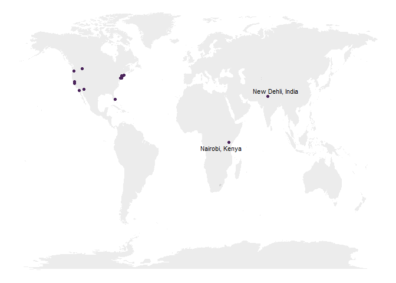

Where are we?
=============

### What's the temperature where we are? Using Google's BigQuery API

In one homework assignment, students connected to [Google's BigQuery
API](https://cloud.google.com/bigquery/public-data "BigQuery Public Data")
to access a public dataset containing weather information collected by
NOAA. They identified a weather station in the state or country in which
they were currently residing, and plotted the average temperature by
month in their location.

Here is similar plot for the class, grouping by each of the different
weather stations we searched.

Dear March - Come in  
by Emily Dickinson

Dear March - Come in -  
How glad I am -  
I hoped for you before -  
Put down your Hat -  
You must have walked -  
How out of Breath you are -  
Dear March, how are you, and the Rest -  
Did you leave Nature well -  
Oh March, Come right upstairs with me -  
I have so much to tell -

I got your Letter, and the Birds -  
The Maples never knew that you were coming -  
I declare - how Red their Faces grew -  
But March, forgive me -  
And all those Hills you left for me to Hue -  
There was no Purple suitable -  
You took it all with you -

Who knocks? That April -  
Lock the Door -  
I will not be pursued -  
He stayed away a Year to call  
When I am occupied -  
But trifles look so trivial  
As soon as you have come

That blame is just as dear as Praise  
And Praise as mere as Blame -
